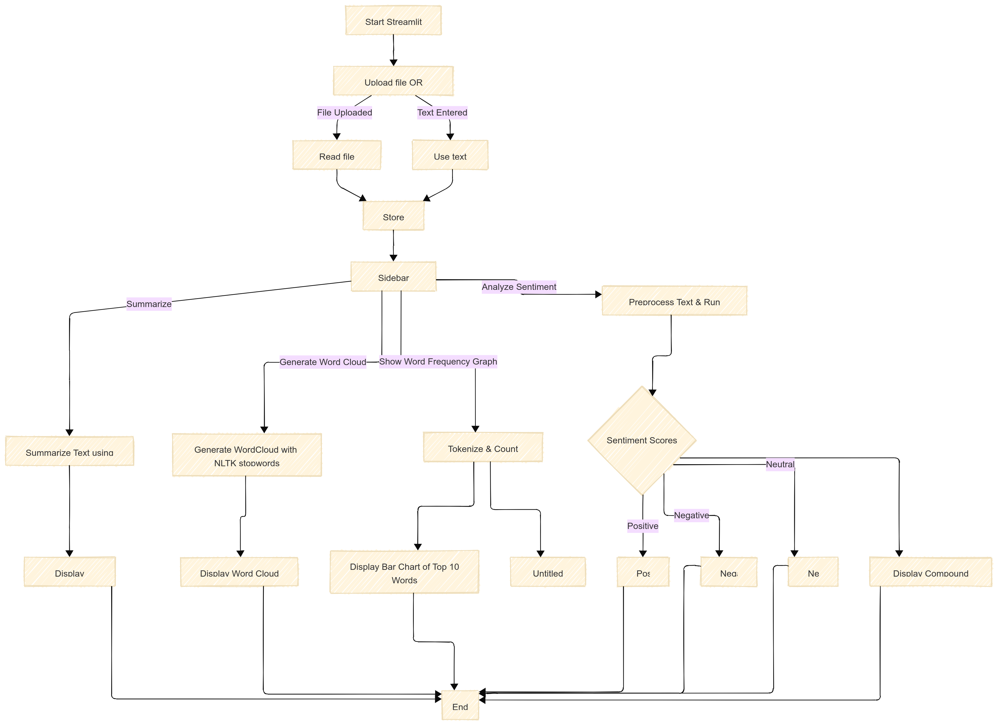

# NLP
Unsupervised based ML that builds a complete Summarisation Pipeline using LSA (Latent Semantic Analysis) and Sentiment Analysis

A sophisticated news article summarization system that leverages Latent Semantic Analysis (LSA) to automatically generate concise and informative summaries from news articles.

## Overview

This project implements a complete Natural Language Processing (NLP) pipeline for text summarization using Latent Semantic Analysis. The system processes raw news articles through multiple NLP techniques to extract the most important sentences, providing users with quick and accurate summaries.

## Architecture

The summarizer follows a pipeline architecture with the following components:

1. **PlainTextParser** - Article preprocessing and parsing
2. **Tokenizer** - Text segmentation and tokenization  
3. **Stemmer** - Word normalization and stemming
4. **LSASummarizer** - Core summarization engine using LSA
5. **Output Generator** - Summary formatting and presentation

## 📊 App Flow

  

## Component Details

### 1. PlainTextParser

**Purpose**: Extracts and cleans text content from news articles

**Key Functions:**
- HTML/XML tag removal and content extraction
- Text normalization and encoding handling
- Article metadata extraction (title, author, date)
- Paragraph and sentence boundary detection
- Special character and noise removal

**Implementation Features:**
- Supports multiple input formats (HTML, plain text, XML)
- Handles different encoding standards
- Removes advertisements and non-content elements
- Preserves paragraph structure for context

### 2. Tokenizer

**Purpose**: Splits text into meaningful units for processing

**Key Functions:**
- Sentence tokenization (sentence boundary detection)
- Word tokenization (breaking sentences into words)
- Punctuation handling and removal
- Contraction expansion (e.g., "don't" → "do not")
- Case normalization

**Implementation Features:**
- Language-specific tokenization rules
- Support for multiple languages
- Customizable tokenization patterns
- Handles abbreviations and special characters

### 3. Stemmer

**Purpose**: Reduces words to their root form for better semantic analysis

**Key Functions:**
- Porter stemming algorithm implementation
- Lemmatization alternatives
- Stop word removal
- Word normalization
- Handling irregular forms

**Implementation Features:**
- Multiple stemming algorithms supported
- Custom stop word lists for different domains
- Performance optimization for large texts
- Language-specific stemming rules

### 4. LSASummarizer (Core Component)

**Purpose**: Performs Latent Semantic Analysis to identify important sentences

**Key Functions:**
- Term-Document Matrix construction
- Singular Value Decomposition (SVD) implementation
- Sentence scoring based on semantic importance
- Optimal sentence selection algorithm
- Redundancy reduction

**Mathematical Foundation:**
- Constructs term-sentence matrix A (m x n)
- Computes SVD: A = UΣVᵀ
- Uses V matrix to identify important sentences
- Applies dimensionality reduction for efficiency

**Implementation Features:**
- Configurable summary length (percentage or absolute)
- Tuning parameters for different article types
- Memory-efficient matrix operations
- Parallel processing support for large articles

